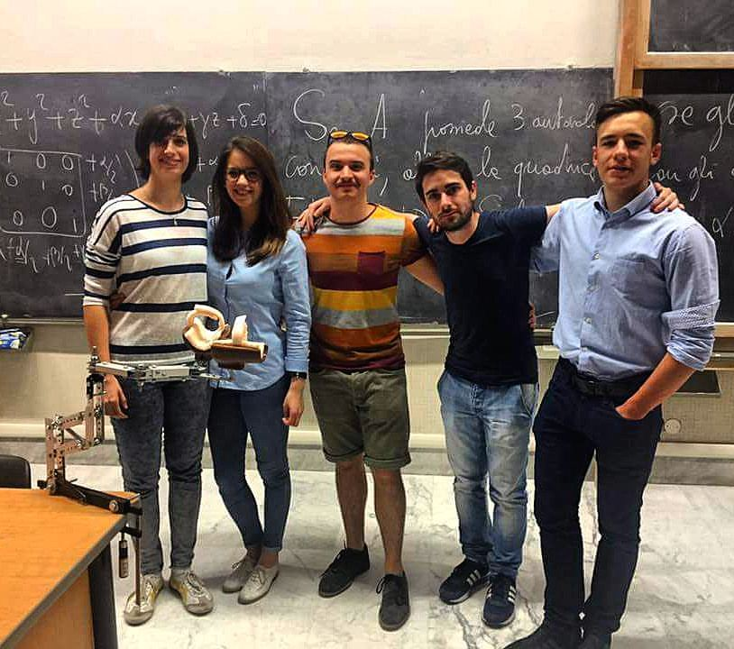

# sMarti

Martina è una bambina di 9 anni soggetta a SMA (Atrofia Muscolare Spinale). Il nostro obiettivo era quello di farle recuperare 
in parte l'uso del bracccio destro, in modo che la bambina possa muoverlo in autonomia nelle azioni di gioco quotidiane. 
Abbiamo quindi costruito un supporto in acciaio e alluminio, agganciabile alla carrozzina,dotato di molle e cuscinetti, 
che sostituisca il lavoro isomentrico della spalla e la aiuti nella flesso-estensione dell'avambraccio.

# Team

- Luca Rabezzana [facebook](https://www.facebook.com/luca.rabezzana.1)
- Giorgia Crida [facebook](https://www.facebook.com/giorgia.crida)
- Diego Gibello Foglio [facebook](https://www.facebook.com/diego.gibellofoglio)
- Anisia Lauditi [facebook](https://www.facebook.com/anisia.lauditi)
- Maurizio Contu [facebook](https://www.facebook.com/maurizio.contu.33)
